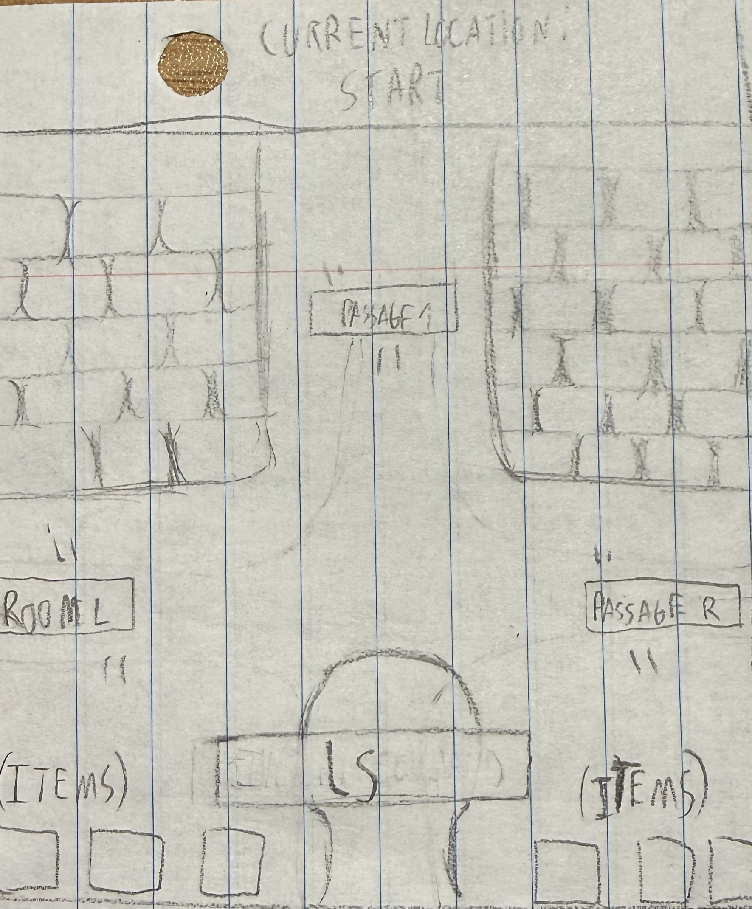

# Command The Dungeon!

## Elevator Pitch

You are stuck in a dungeon, and you don't know how you got there. You cannot move your legs; instead, you are presented with a text box and a paper that says "use the cd to escape". Your objective is to escape the dungeon using the cd command, picking up variations of it, and different commands along the way to help you with your escape.

## Influences (Brief)

- 3D Monster Maze:
  - Medium: PC Game
  - Explanation: Its visuals simulate a 3D environment; however, it is only 2D images. It is the type of aesthetic we tried to achieve with this game.
- Colossal Cave Adventure:
  - Medium: PC Game
  - Explanation: The game shows how actions written in a text section make the character perform actions. This was our reference for our mechanic of moving using terminal commands.

## Core Gameplay Mechanics (Brief)

- Move through the dungeon by writing the name of the passages in front of you, using the "cd" terminal command in a text box.
- The passage name written with the "cd" command must be written with appropriate casing and syntax.
- Return to the previous room you were in by using the "cd .." command properly.
- When entering any room/passage, the player can write the "ls" command to inspect their current location.
- The player can also write the "ls -a" command to unravel possible secrets hidden in the rooms/passages.
- Command "mv" is used to interact with objects, adding them to your inventory, or using them with other objects/identities.
- Entering a command with wrong syntax will result in a message indicating what has been written incorrectly.
- The player will need to find certain objects to open specific doors to escape the dungeon.
- When the player escapes the dungeon, the game changes into a new scene, indicating that the player has won.

# Learning Aspects

## Learning Domains

Correct use and implementation of terminal commands "cd", "ls", and "mv", including variations and different forms such as "cd .." and "ls -a".

## Target Audiences

- Novice programmers with little to no knowledge of navigating a terminal.
- Aimed for early university students and advanced high school students.

## Target Contexts

- The game would be assigned as a practice, which would then be tested to see if students were able to comprehend the use of both "cd" and "ls" commands.
  
## Learning Objectives

- By the end of the game, the player will be able to identify and apply basic console commands.
- By the end of the game, the player will be able to identify and apply commands to navigate to a directory in the current and parent directory
- By the end of the game, the player will be able to identify and apply commands to check the contents of a directory.
- By the end of the game, the player will be able to identify and compare hidden files from non-hidden files.

## Prerequisite Knowledge

- Write words on the keyboard
- Identify and explain what cd is meant to do
- Identify and explain what ls is meant to do
- Identify and explain what mv is meant to do

## Assessment Measures

*Clearly identify a set of viable assessment questions AND their grading logic. The questions should be specific examples of the kinds of questions that your game could conceivably improve student performance on. For the grading logic, it could be the correct answer, a rubric for evaluating the answer, or exact logic for deriving answers.*

Write the console commands you would use to do the following:
- Find file names in your folder *Answer: ls*
- Enter a folder name within the current folder *Answer: cd a*
- Return to the parent folder *cd ..*
- Find the name of the hidden file in your folder *ls -a*
- Move a file from one place to another.

# What sets this project apart?

*Give some reasons why this game is not like every other game out there. Whether the learning objective is unique, the gameplay mechanics are new, or what. You should persuade the reader that your game is novel and worthy of development. Consider arguments that would be persuasive to a Venture Capitalist, Teacher, or Researcher. These might be focused on learning needs, too.*

- Most activities regarding terminal commands lack excitement and are felt to be monotone by many students.
- This game allows the navigation of directories to be fun by adding exploration to the equation.
- The dungeon atmosphere and interactable objects/entities allow the player's interest to be greater when using terminal commands.
   - The interest in the player encourages them to use the commands more often, resulting in unconsciously learning them and being able to apply them without effort.

# Player Interaction Patterns and Modes

## Player Interaction Pattern

Single player game. The player controls their movements and actions through writing terminal commands.

## Player Modes

- Single Player: Player moves around the dungeon, looking for items to open doors and, eventually, escape.
- Main Menu: The player will see a start menu which will allow them to start the game, quit it, and adjust the volume.

# Gameplay Objectives

- Gather key items:
    - Description: When key items are collected, the player will be able to open doors and advance to new areas. 
    - Alignment: *Describe how this aligns with one or more learning objectives*
- Gather mask pieces:
    - Description: When the player gathers all the pieces of a mask, it will open the final door, which will allow the player to escape the dungeon.
    - Alignment: *Describe how this aligns with one or more learning objectives*
- Collect new commands:
    - Description: The player will gather small notes that will allow him to introduce new commands in the text box, doing new things.
    - Alignment: *Describe how this aligns with one or more learning objectives*

# Procedures/Actions

- A text box will be presented for the player to input terminal commands.
- 6 squares on the bottom represent the items the player possesses, and the ones he can interact with.
- Passage names represent accessible directories found in other directories in a terminal command.
- Item names represent non-directory files that the player can interact with.

# Rules

- If the player enters the right "cd" command with an existing passage/room name, it will change scenes to a new passage/room with new names.
- If the player enters the right "ls" command with an existing passage/room name, the player is shown what things they can interact with.
- If the player enters the right "mov" command with an existing Object name, the player will be able to put that object in their items or use it somewhere else.
- If the player enters either the "cd", "ls", or the "mov" command, or any of its variations, incorrectly, an error message appears that says "Command does not exist".
- If the player enters the "cd .." command, the player will be sent back to the previous passage/room they have previously been in.
- If the player enters the "ls -a" command, the player is shown what things they can interact with, plus secret things not shown with "ls".
- An incorrect passage/room name will result in a text saying "There is no place with that name".
- An incorrect object name will result in a text saying "There is no object with that name".
  
# Objects/Entities

- An interactable live skeleton that makes a variable true for the player to use the "ls -a" command.
- An interactable mask that provides the player with the main goal of the game.
- A text box in the lower center of the screen where the player can write the commands.
- 6 squares on the bottom that indicate the items the player currently has.
- Doors that will require keys to be opened.
- Keys that are required to open locked doors.
- Mask pieces that are meant to be combined to open the final door.

## Core Gameplay Mechanics (Detailed)

- Write commands in the text box and press Enter to use them.
    - ls: The ls command will be used to inspect the current room/passage to search for items or the names of other accessible passages the player can move to. The command will also reveal objects that the player can interact with or entities that the player can talk to. There is a variation that appears after talking to the skeleton, which will be the command "ls -a", that will have the same effect as ls, but with the addition that it can reveal hidden objects not previously shown.
    - cd: The command will allow the player to move from place to place by typing it with the name of the desired location they want to move to. If the player wants to go to a passage called "Passage1", then the player will need to type "cd Passage1" on the text box, syntactically equal, to be able to move there. On the other hand, if the player wants to return to the room they were previously in, they will need to run the command "cd ..".
    - mov: The command will allow the player to interact with certain objects throughout the game. There are two ways in which the player will be able to do that: First, when the player sees an object and wants to grab it, the player must write "mv '<objectName>' Items" to store the item in its inventory. Second, when it wants to use that item with another object/entity, the command to be written must be "mv '<ObjectName>' '<objectToInteract>'" to use the item on that particular object.
- The doors the player encounters in the halls are always locked, and they will require a specific key to open them. This will be true with every door, except with the last one. The last door will have a hole where a mask must be inserted to open it. There will be 4 pieces of such mask that must be collected by the player and placed in the door. 
- When the player encounters an entity, such as the talking skeleton or the talking mask, a dialogue will appear automatically. However, the dialogue will not continue until the player presses Enter on their keyboard to ensure it has read what the entity had to say. The dialogue will close once the player reaches the last line. 
- After the player collects 4 parts of a mask, it can be used with the final door of the dungeon, which will end the game, making the player a winner.
    
## Feedback
At certain points in the game, they will be shown commands to be introduced to them. After that, using something other than those commands would be beyond the scope of the game, but using commands incorrectly would give some feedback. For example, cding to a nonexistent folder would show an error that the folder doesn't exist and probably hint at using ls.

# Story and Gameplay

## Presentation of Rules

The core gameplay mechanics are simple, so rather than worrying about forgetting or ignoring what they are, the game will slowly give the player the chance to learn how to apply it hands on. Small hints and directions may be given to make it easier for players newer to the topic to deduce the correct command.

## Presentation of Content

They will be briefly introduced to one mechanic at a time and slowly spend time applying that mechanic. Repeatedly using a few major mechanics should be good for memory.

## Story (Brief)

You are trapped in an unknown dungeon, and you are incapacitated. You must use command terminals to get out.

## Storyboarding

# Assets Needed

## Aethestics

The game should be a simple pixel art, but one that simulates that the player is in a 3D space, simulating a dungeon. It should be visually appealing enough so that the player wants to explore it.

## Graphical

- Characters List
  - Skeleton in room: Should be in a sitting position, and be composed of two parts: Body, which remains static, and skull, which will have two frames of animation where its teeth move up and down, indicating that it is talking.
  - Mask in hallway: Hanging on a wall, it will be composed of only one part, which is the mask itself. It will have two frames of animation where its lips are moving, which indicates the mask is talking.
- Textures: N/A
- Environment Art/Textures:
  - Walls: Should replicate an old stone brick wall. Not many details, but enough to make it look rocky.
  - Floor: The floor should follow the same logic as the wall.
  - Doors: The doors are to represent that they are made out of wood, and simulate old medieval doors with an arch at the top. They should have a door handle for more immersion.
  - Final door: The final door will have the same design as the normal doors, with the difference that it will have a hole in the center, where a mask would go and unlock it.

## Audio

- Music List (Ambient sound)
  - Main Menu: Slightly ominous, but rather calm music. Something like [Resident Evil Deadly Silence Save Room Theme.](https://www.youtube.com/watch?v=OPjU6lxEEw8&list=RDOPjU6lxEEw8&start_radio=1)
  - General Gameplay: Somewhat low, but continuous music that can generate a sense of the unknown to the player. Like [The True Lab song from Undertale.](https://www.youtube.com/watch?v=52olsp3GUqY&list=RD52olsp3GUqY&start_radio=1)
  - When talking to the skeleton: A happier and somewhat comedic music. Like [Bonetrousle from Undertale](https://www.youtube.com/watch?v=AKAiUtWZ4xY&list=RDAKAiUtWZ4xY&start_radio=1)
  - When talking to the mask: A more analogical song to show the mask has ancient origins. Like the [Aku Aku Theme from Crash Bandicoot.](https://www.youtube.com/watch?v=5XhjviN1yMA&list=RD5XhjviN1yMA&start_radio=1)

- Sound List (SFX)
  - Skeleton sound/voice: Recoded by Jeremias Brana Tonelli.
  - Mask sound/voice: Recoded by Jeremias Brana Tonelli.
  - Door opened: Something similar to [Resident Evil SFX Door Opening](https://www.youtube.com/watch?v=ZNU29JfzKOI)
  - Final door opened: Something similar and ominous like [Resident Evil 4 - Sound Effect - Key Item.](https://www.youtube.com/watch?v=nEUJwPR6gP4)
  - Pick up item: A simple pick up sound like [Pickup Item Sound Effect.](https://www.youtube.com/watch?v=warMJ_4uUuY)

# Metadata

* Template created by Austin Cory Bart <acbart@udel.edu>, Mark Sheriff, Alec Markarian, and Benjamin Stanley.
* Version 0.0.3
